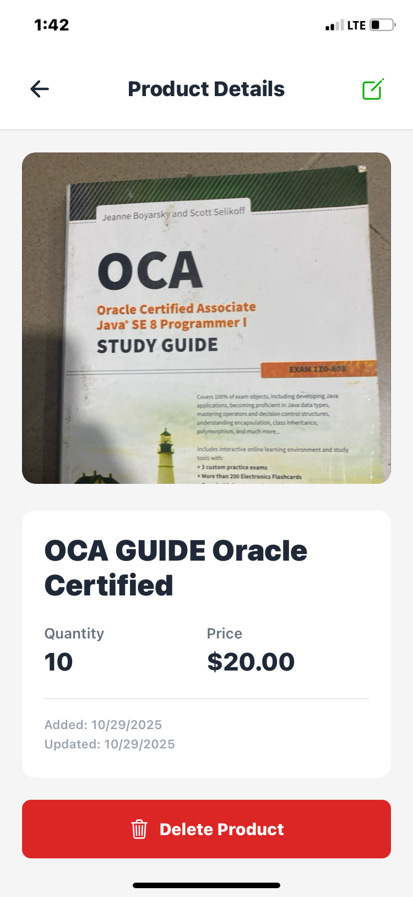

# Storekeeper App

A mobile inventory management application built with React Native and Expo, featuring local SQLite database storage and native camera integration.

## Features

- ✅ **CRUD Operations**: Create, Read, Update, and Delete products
- 📦 **SQLite Database**: Persistent local storage using expo-sqlite
- 📸 **Camera Integration**: Capture or upload product images using native camera
- 🎨 **Clean UI**: Modern, responsive design with smooth animations
- 🔄 **Real-time Updates**: Pull-to-refresh functionality
- 🎯 **TypeScript**: Fully typed codebase for better developer experience

## Try it Online

[**Run on Appetize**](https://appetize.io/app/)

## Demo Video

[**Watch Demo Video**](https://drive.google.com/file/)

## Download APK

[**Download Latest Release (v1.0.0)**](https://drive.google.com/file)

## Tech Stack

- **Framework**: React Native with Expo
- **Language**: TypeScript
- **Database**: SQLite (expo-sqlite)
- **Navigation**: Expo Router
- **Camera**: expo-camera & expo-image-picker
- **Icons**: @expo/vector-icons

## Prerequisites

- Node.js (v18 or higher)
- npm or yarn or pnpm
- Expo CLI
- Android Studio (for Android) or Xcode (for iOS)

## Installation & Setup

### 1. Clone the Repository

```bash
git https://github.com/Promisead/storekeeper-mobileApp.git
cd storekeeper-app
```

### 2. Install Dependencies

```bash
npm install
```

### 3. Run the Development Server

```bash
npx expo start
```

### 4. Run on Device/Emulator

- **Android**: Press `a` in the terminal or scan QR code with Expo Go app
- **iOS**: Press `i` in the terminal (macOS only)
- **Web**: Press `w` in the terminal

## Building for Production

### Android APK

```bash
# Install EAS CLI
npm install -g eas-cli

# Login to Expo
eas login

# Configure build
eas build:configure

# Build APK
eas build -p android --profile preview
```

### iOS

```bash
eas build -p ios --profile preview
```

## Project Structure

```javascript
storekeeper-app/
├── app/
│   ├── (tabs)/
│   │   ├── index.tsx          # Home/Products List
│   │   └── add-product.tsx    # Add Product Screen
│   |   └── _layout.tsx        # Tabs Layout
│   ├── product/[id].tsx       # Product Details/Edit
│   ├── _layout.tsx
│   └── +not-found.tsx
├── components/
│   ├── ProductCard.tsx        # Product item in list
│   ├── ProductForm.tsx        # Form for add/edit product
│   ├── CameraButton.tsx       # Camera button component
│   └── ImagePicker.tsx        # Image picker component
├── database/
│   ├── database.ts            # SQLite setup
│   └── schema.ts              # Database schema
├── services/
│   ├── productService.ts      # CRUD operations
│   └── imageService.ts        # Image handling
├── types/
│   └── product.ts             # TypeScript types
└── README.md
```

## Database Schema

```sql
CREATE TABLE products (
  id TEXT PRIMARY KEY NOT NULL,
  name TEXT NOT NULL,
  quantity INTEGER NOT NULL,
  price REAL NOT NULL,
  image_uri TEXT,
  created_at INTEGER NOT NULL,
  updated_at INTEGER NOT NULL
);
```

## Screenshots

| Home Screen                   | Product                 
| ----------------------------- | --------------------------- 
|  |  | 

## Usage

1. **View Products**: Launch the app to see your inventory list
2. **Add Product**: Tap the + button, fill in details, optionally add a photo
3. **Edit Product**: Tap on any product, then tap the edit icon
4. **Delete Product**: Open product details and tap the delete button
5. **Take Photo**: Use camera icon to capture or select product images

## Permissions

The app requires the following permissions:

- **Camera**: To capture product photos
- **Photo Library**: To select existing images

## Known Issues

- None currently reported

## Author

### Promise Duke

- GitHub: [@promise Duke](https://github.com/Promiseead/storekeeper-mobileApp.git)
- Twitter: [Promise Duke](https://x.com/Promisedukeac)

## Acknowledgments

- Built for HNG Internship Mobile Track Stage 2
- Design inspiration from behance
- Icons by Expo Vector Icons

---

Made with ❤️ for HNG Internship
