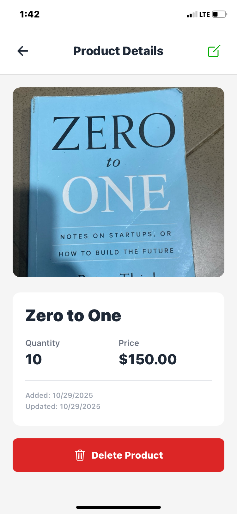

# 📱 Storekeeper App

A **mobile inventory management application** built with **React Native** and **Expo**, featuring **local SQLite database storage**, smooth **camera integration**, and a **modern user-friendly interface**.

---

## 🚀 Overview

Storekeeper helps small business owners and retailers manage their product inventory seamlessly — offline or online.  
It allows you to **add, edit, delete, and view** products, with real-time updates and local persistence via SQLite.

---

## ✨ Features

- ✅ **Full CRUD Support** – Create, Read, Update, and Delete products effortlessly  
- 📦 **Local Storage** – Persistent data storage using `expo-sqlite`  
- 📸 **Camera Integration** – Capture or upload product images directly from your device  
- 🎨 **Modern UI/UX** – Clean, responsive design with smooth animations  
- 🔄 **Real-Time Refresh** – Pull-to-refresh functionality for live updates  
- 🧠 **TypeScript Powered** – Type-safe, scalable, and developer-friendly codebase  

---

## 🌐 Live Demo

- ▶️ [**Run on Appetize**](https://appetize.io/app/b_6avka227oyusjvz3sdhh5jgg6i)  
- 🎥 [**Watch Demo Video**](https://drive.google.com/file/d/1LCQLgn8gKbRPGD3Vht2boM1X5TOpQx69/view?usp=sharing)

---

## 🧰 Tech Stack

| Category | Technology |
|-----------|-------------|
| **Framework** | React Native (Expo) |
| **Language** | TypeScript |
| **Database** | SQLite (`expo-sqlite`) |
| **Navigation** | Expo Router |
| **Camera & Media** | `expo-camera`, `expo-image-picker` |
| **Icons** | `@expo/vector-icons` |

---

## ⚙️ Prerequisites

Before starting, make sure you have:

- Node.js **v18+**
- npm, yarn, or pnpm
- Expo CLI
- Android Studio (for Android) or Xcode (for iOS)

---

## 🧩 Installation & Setup

### 1️⃣ Clone the Repository

```bash
git clone https://github.com/Promisead/storekeeper-mobileApp.git
cd storekeeper-app
```

### 2️⃣ Install Dependencies

```bash
npm install
```

### 3️⃣ Start the Development Server

```bash
npx expo start
```

### 4️⃣ Run the App

- **Android** → Press `a` or scan the QR code in the terminal with **Expo Go**  
- **iOS (macOS only)** → Press `i`  
- **Web** → Press `w`

---

## 🏗️ Building for Production

### Android APK

```bash
# Install EAS CLI
npm install -g eas-cli

# Login to Expo
eas login

# Configure the build
eas build:configure

# Build the APK
eas build -p android --profile preview
```

### iOS Build

```bash
eas build -p ios --profile preview
```

---

## 🗂️ Project Structure

```plaintext
storekeeper-app/
├── app/
│   ├── (tabs)/
│   │   ├── index.tsx          # Home / Products List
│   │   ├── add-product.tsx    # Add Product Screen
│   │   └── _layout.tsx        # Tabs Layout
│   ├── product/[id].tsx       # Product Details & Edit Screen
│   ├── _layout.tsx
│   └── +not-found.tsx
├── components/
│   ├── ProductCard.tsx        # Product item component
│   ├── ProductForm.tsx        # Add/Edit product form
│   ├── CameraButton.tsx       # Camera action button
│   └── ImagePicker.tsx        # Image picker utility
├── database/
│   ├── database.ts            # SQLite setup
│   └── schema.ts              # Database schema definition
├── services/
│   ├── productService.ts      # CRUD logic
│   └── imageService.ts        # Image processing
├── types/
│   └── product.ts             # TypeScript interfaces
└── README.md
```

---

## 🧮 Database Schema

```sql
CREATE TABLE products (
  id TEXT PRIMARY KEY NOT NULL,
  name TEXT NOT NULL,
  quantity INTEGER NOT NULL,
  price REAL NOT NULL,
  image_uri TEXT,
  created_at INTEGER NOT NULL,
  updated_at INTEGER NOT NULL
);
```

---

## 🖼️ Screenshots

| Product List | Product Detail |
|---------------|----------------|
|  |  |

---

## 📘 Usage Guide

1. **View Products** → See all stored inventory items on the home screen  
2. **Add Product** → Tap the **“+”** button to register new items  
3. **Edit Product** → Open a product and tap the **edit icon**  
4. **Delete Product** → Tap the **delete** button in the product detail view  
5. **Capture Image** → Use the camera or upload from the gallery  

---

## 🔐 Permissions

This app requires the following permissions:

- **Camera** → Capture new product images  
- **Photo Library** → Select existing photos  

---

## 🧩 Known Issues

- No known issues at this time 🚀  

---

## 👨‍💻 Author

**Promise Duke**  
- 🌐 [GitHub](https://github.com/Promiseead/storekeeper-mobileApp.git)  
- 🐦 [Twitter](https://x.com/Promisedukeac)


